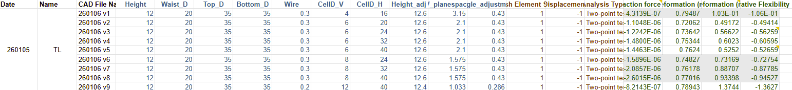

# Mitral Valve Design Team Parameter Optimization

Trains a model based on ANSYS simulation results of different configurations of design parameters (cell height, wire thickness, etc.)

---

## Goals / Summary

- Using the manual ANSYS simulation data with varied CAD parameters, a model was trained to be able to predict future outcomes and optimize parameters
- Surrogate model was used due to low sample size
- Maps 12 input parameters onto the 4 outputs simultaenously, multi-output regression
- Multi-output regression was used over 4 separate models because the outputs are likely correlated --> able to predict better with lower volume of data / prevents overfitting

Model Choice: Random forest
- Works well with smaller datasets, linear regeression would be too simple whereas NN's would require too many samples
- Shallower trees (max_depth = 3) as preventative measures for overfitting
- Leave-One-Out cross validation (LOO-CV): trained on 8 samples, test on 1 --> repeat 9 times and average performance over all 9 tests
- StandardScaler: normalizes the data, i.e. transforms each feature to mean = 0, std = 1. Just some more measures to prevent outlier impact
- Multi-output regressor warpper: wraps the random forests so that it can handle the multiple outputs (justification mentioned above).
---

## Requirements
- This ipynb file + an excel file formatted as such:

### Software
- Python Notebook file (Python 3.8.10 was used for this iteration)
- Imports: pandas, numpy, sklearn, matplotlib, seaborn
- No special OS requirements
